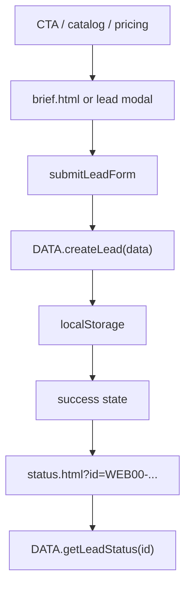
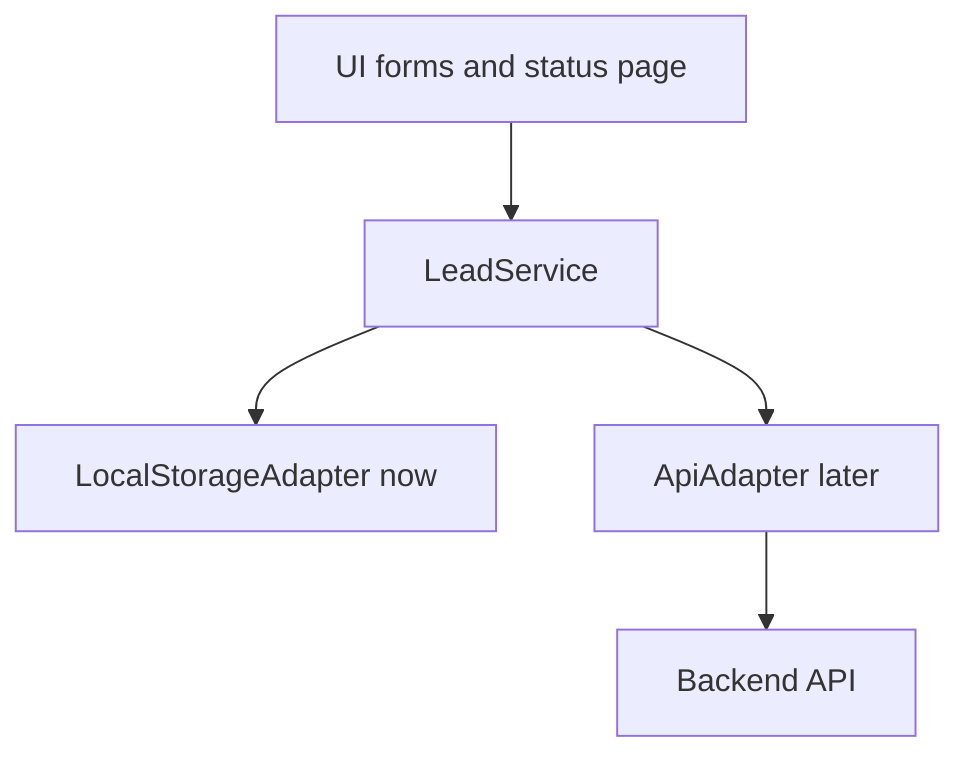

# WEB00 Backend Readiness Audit

Дата: 2026-07-03  
Текущий статус: **NOT READY**

## 1. Что сейчас есть

WEB00 сейчас работает как frontend-preview:

- статические HTML страницы
- один общий `assets/js/main.js`
- данные в `assets/js/data.js`
- заявки и статусы через `localStorage`
- демо через iframe/modal
- анкета `brief.html`
- статус `status.html?id=...`

## 2. Что backend пока не имеет

Нет:

- реального API
- серверной базы заявок
- авторизации
- админки
- платежей
- уведомлений
- Telegram/MAX/VK delivery pipeline
- server-side validation
- server-side status transitions
- anti-spam/rate limit
- логирования и мониторинга

## 3. Текущий frontend flow



## 4. Backend integration target

Нужен adapter boundary:



Если сделать этот слой, UI не придётся переписывать при переходе на backend.

## 5. Рекомендуемые API endpoints

| Endpoint | Method | Назначение |
|---|---|---|
| `/api/leads` | POST | создать заявку/анкету |
| `/api/leads/:id` | GET | получить статус заявки |
| `/api/leads/:id/events` | GET | история/таймлайн |
| `/api/contact` | POST | быстрый контакт/вопрос |
| `/api/bug-reports` | POST | report issue, если оставлять |
| `/api/catalog` | GET | каталог решений, если выносить из frontend |
| `/api/pricing` | GET | тарифы, если управлять из админки |

## 6. Lead payload draft

```json
{
  "source": "brief_page",
  "solutionId": "mebel",
  "tariff": "Business",
  "service": null,
  "contact": {
    "name": "string",
    "phone": "string",
    "messenger": "telegram",
    "email": "string"
  },
  "project": {
    "businessName": "string",
    "niche": "string",
    "description": "string",
    "style": "string",
    "examples": "string",
    "needsDomain": true,
    "needsRequests": true,
    "needsBlog": false,
    "comment": "string"
  },
  "consent": true,
  "createdAt": "ISO-8601"
}
```

## 7. Status model draft

Client-facing statuses:

1. `questionnaire_received` - Анкета получена
2. `details_review` - Уточняем детали
3. `materials` - Материалы
4. `site_in_work` - Сайт в работе
5. `quality_check` - Проверка качества
6. `approval` - Согласование
7. `published` - Публикация
8. `support` - Поддержка

## 8. Current blockers

| ID | Severity | Блокер |
|---|---:|---|
| B-001 | P0 | Нет API adapter boundary, UI напрямую использует `DATA.createLead` |
| B-002 | P0 | Нет server persistence |
| B-003 | P0 | Нет server validation/sanitization |
| B-004 | P1 | Pricing/data model ещё не совпадает с новой бизнес-моделью |
| B-005 | P1 | Status dashboard пока preview/localStorage |
| B-006 | P1 | Consent/privacy не завязаны на backend logging |
| B-007 | P1 | Нет error model для API failures |
| B-008 | P2 | Нет админского статуса/истории |

## 9. Что нельзя делать перед backend

- подключать backend напрямую в DOM-handlers без adapter layer
- хранить secrets/API keys во frontend
- обещать реальный личный кабинет/оплату/уведомления до реализации
- смешивать mock localStorage и real API без явного feature flag
- менять route names без migration plan

## 10. Readiness Verdict

Backend readiness: **NO**

Минимальный путь к readiness:

1. утвердить data/pricing contract
2. выделить `LeadService`
3. сохранить localStorage adapter как fallback/mock
4. добавить API adapter
5. описать ошибки и статусы
6. после этого подключать backend

